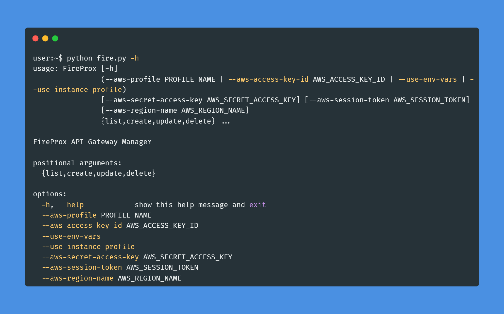
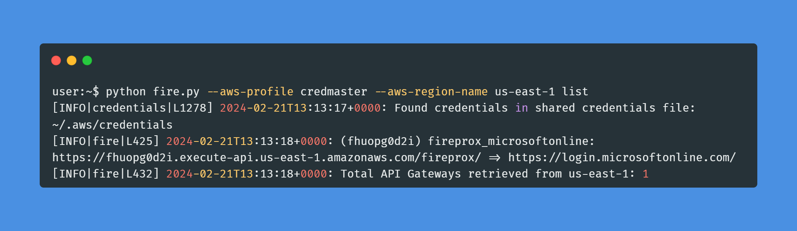
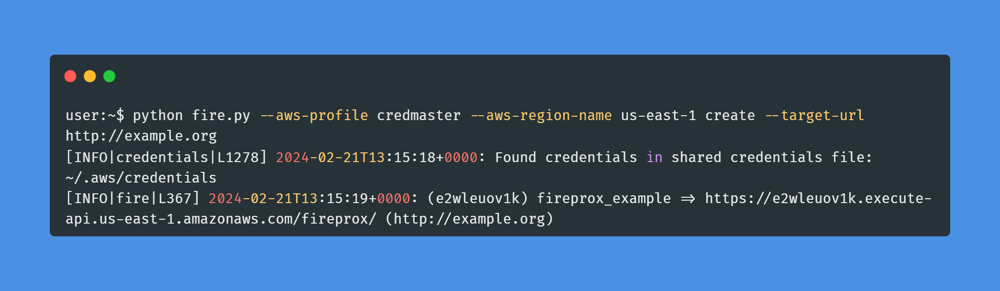
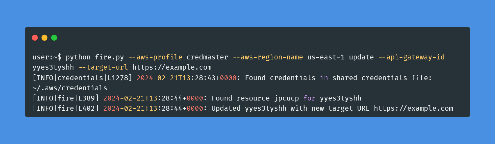
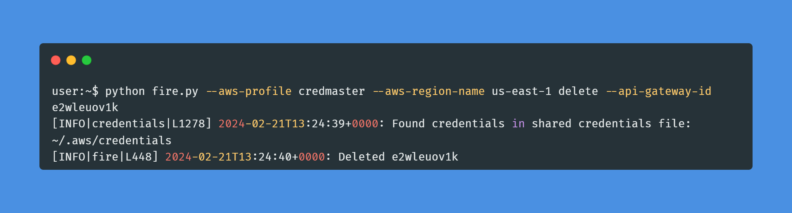

# FireProx

- [FireProx](#fireprox)
  - [Overview](#overview)
  - [Benefits](#benefits)
  - [Main changes from original](#main-changes-from-original)
  - [Basic Usage](#basic-usage)
  - [Installation](#installation)
  - [Screenshots](#screenshots)
    - [List](#list)
    - [Create](#create)
    - [Update](#update)
    - [Delete](#delete)

## Overview

Being able to hide or continually rotate the source IP address when making web calls can be difficult or expensive. A number of tools have existed for some time but they were either limited with the number of IP addresses, were expensive, or required deployment of lots of VPS's. FireProx leverages the AWS API Gateway to create pass-through proxies that rotate the source IP address with every request! Use FireProx to create a proxy URL that points to a destination server and then make web requests to the proxy URL which returns the destination server response!

## Benefits

 * Rotates IP address with every request
 * Configure separate regions
 * All HTTP methods supported
 * All parameters and URI's are passed through
 * Create, delete, list, or update proxies
 * Spoof X-Forwarded-For source IP header by requesting with an X-My-X-Forwarded-For header

## Main changes from original

 * Refactored argument handling
 * JSON logging module


## Basic Usage

Authentication requires AWS API keys or a profile configured for `awscli`.



         
## Installation

You can install and run with the following command:

```bash
user:~$ git clone https://github.com/aodhn/fireprox-fork
user:~$ cd fireprox
user:~/fireprox$ virtualenv -p python3 .
user:~/fireprox$ source bin/activate
(fireprox) user:~/fireprox$ pip install -r requirements.txt
(fireprox) user:~/fireprox$ python fire.py -h
```

> [!IMPORTANT]  
> Python 3.10 or higher is required.

## Screenshots

### List



### Create



### Update



### Delete


